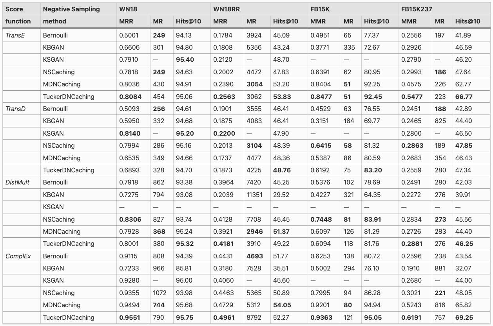

# TuckerDNCaching

## Project Setup
To set up the project, follow these steps:

1. Clone the repository:
```shell
git clone https://github.com/ichise-laboratory/tuckerdncaching.git
```

2. Install the required dependencies:
```shell
pip install -r requirements.txt
```

3. Run the project:
```python
python examples/complex_fb15k237.py
```

## Best Results

Comparison of state-of-the-art negative sampling methods on WN18, WN18RR, FB15K and FB15K237 datasets

Note that results for the MR metric and all metric results for the DistMult KGE model for all datasets are not available for KSGAN. Metric results for all KGE models for the FB15K dataset are also not available for KSGAN as the original did not include them.

## Paper Citation

If you find this research helpful, please consider citing our paper:
```
@article{tiroshan2022tuckerdncaching,
	title        = {Tucker{DNC}aching: high-quality Negative Sampling with Tucker Decomposition},
	author       = {Madushanka, Tiroshan and Ichise, Ryutaro"},
	journal      = {Journal of Intelligent Information Systems},
	volume       = {60},
        number       = {3},
	pages        = {}
}
```
